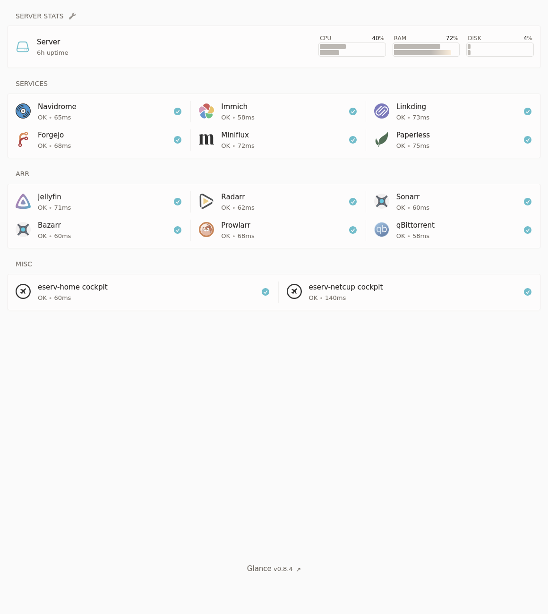

# Building a custom NAS/homeserver with Fedora CoreOS

> 100% ORGANIC HUMAN-WRITTEN CONTENT

This is not a tutorial, but a description of how I set up my NAS, along with some commentary, tips, and tricks. Feel free to follow in my footsteps, though.

<!--For more related guidance from me, check out the [Web- and self-hosting cheatsheet](/blog/hosting-cheatsheet/).-->

#### Table Of Contents:
- [1. Hardware](#1-hardware)
- [2. OS installation](#2-os-installation)
- [3. ZFS](#3-zfs)
- [4. Data migration](#4-data-migration)
- [5. What’s a computer?](#5-whats-a-computer)
- [6. Remote access](#6-remote-access)
- [7. `podman compose`](#7-podman-compose)
- [8. Service migration](#8-service-migration)
- [9. Cool additions](#9-cool-additions)
- [10. Snapshots, backups, and data integrity](#10-snapshots-backups-and-data-integrity)
- [11. Conclusion](#11-conclusion)

## 1. Hardware

After I started self-hosting using docker-compose on an off-the-shelf QNAP NAS, I've been just dreaming of building a custom NAS and running a custom Linux OS on it (not something like Truenas or Unraid, or QNAP QTS god forbid).

Well, my dad recently got a new PC and I got his old one to use for this purpose, along with some used 6TB disks that were recently replaced with larger ones on our QNAP NAS.

Here are the specs of the PC (it was built around 2019 to function as a pre-ChatGPT era local AI and 3D graphics workstation):
- CPU: Intel Core i9 9900K (Coffee Lake)
- RAM: 4x16GB G.Skill 1066MHz DDR4 (F4-3200C16-16GVK)
- GPU: NVIDIA Titan RTX (24GB VRAM)
  - We took this out to sell, since it probably would be pretty useless for a NAS build, and we have a few other GPUs that are in use in our desktop PCs.
- Case: Fractal Design (maybe the R6)
  - As far as Fractal Design cases go, they are great! But this one is definitely a sleeper. There are no windowed side panels and tons of soundproofing to optionally cover the vents. 
- Motherboard: ASRock Z390 Taichi Ultimate
  - The motherboard is truly a beast. 8xSATA3 and 3 M.2 slots are more than I will need for a while, and a single 10Gbit ethernet port is a nice bonus.

The drives I got are:
- 4x 6TB WD Black (WD6001FZWX)
- 1x 6TB Seagate BarraCuda Pro (ST6000DM004)
- 1x 1TB Samsung 970 EVO M.2 SSD
- 1x 500GB Samsung 970 EVO M.2 SSD

## 2. OS installation

As the OS to install, I picked [ucore](https://github.com/ublue-os/ucore) (a custom image of Fedora CoreOS with useful features for homeserver usage). More specifically, I'm using the `ucore:stable` variant.

I picked this mostly because as a [BlueBuild](https://blue-build.org/) developer and a Fedora bootc desktop user, I am also pretty close to the [Universal Blue](https://universal-blue.org/) community, which maintains ucore. I believe image-based Linux distribution is the future and I want to use atomic distributions on all my machines, and while I could have built my own bootc image, this one already exists and does everything that I would do as well without me having to think about it separately. This model fits servers especially well, since most software I want to self-host on it I will be running with containers using `podman`.

Installing CoreOS requires creating an _ignition file_, which can be generated from a _butane configuration_. I used the [ucore example butane file](https://github.com/ublue-os/ucore/blob/main/examples/ucore-autorebase.butane) with my own auth details, and an additional section to set the hostname:
```yaml
storage:
  files:
    - path: /etc/hostname
      mode: 0644
      overwrite: true
      contents:
        inline: eserv-home
```

For building the ignition file from the butane file and serving it I used the following [Justfile](https://just.systems/):
```just
serve-butane: build-butane
    caddy file-server --root serve --listen :8080 &
    tailscale funnel 8080

build-butane:
    mkdir -p serve
    podman run --interactive --pull=newer --rm quay.io/coreos/butane:release \
       --pretty --strict < config.bu > serve/config.ign
```

And for installing I used the usual bare metal Fedora CoreOS .iso file and the following command: 
```bash
sudo coreos-installer install /dev/nvme1n1 --ignition-url https://my-pc.tail12345.ts.net/config.ign
```

(`/dev/nvme1n1` is the 500GB M.2 SSD, which I picked to be the boot drive)

## 3. ZFS

> To get a basic understanding of ZFS, I read a ton of tutorials and watched some videos. You should too. Here are some links:
> - https://ikrima.dev/dev-notes/homelab/zfs-cheatsheet/
> - https://blog.victormendonca.com/2020/11/03/zfs-for-dummies/
> - https://neil.computer/notes/how-to-setup-minimal-zfs-nas-without-truenas/
> - https://jrs-s.net/2015/02/06/zfs-you-should-use-mirror-vdevs-not-raidz/

I was initially planning to go for two mirror VDEVs, but since I got 5 disks, I picked a 5-disk-wide RAIDZ2 instead.

First, following the instructions from [How to Build a Minimal ZFS NAS without Synology, QNAP, TrueNAS](https://neil.computer/notes/how-to-setup-minimal-zfs-nas-without-truenas/) I added the following lines to `/etc/zfs/vdev_id.conf` to make sure my drives have static human-readable aliases:
```conf
alias hdd0 /dev/disk/by-id/ata-WDC_WD6001FZWX-00A2VA0_WD-WXXXXXXXXXXX
alias hdd1 /dev/disk/by-id/ata-WDC_WD6001FZWX-00A2VA0_WD-WXXXXXXXXXXX
alias hdd2 /dev/disk/by-id/ata-WDC_WD6001FZWX-00A2VA0_WD-WXXXXXXXXXXX
alias hdd3 /dev/disk/by-id/ata-ST6000DM004-2EH11C_XXXXXXXX
alias hdd4 /dev/disk/by-id/ata-WDC_WD6001FZWX-00A2VA0_WD-WXXXXXXXXXXX
```

And to set the aliases:
```bash
sudo udevadm trigger
```

Then I had to run the following command to get rid of existing filesystems, partitions, and md raid on the HDD disks:
```bash
sudo sgdisk --zap-all /dev/disk/by-vdev/hdd0
sudo sgdisk --zap-all /dev/disk/by-vdev/hdd1
sudo sgdisk --zap-all /dev/disk/by-vdev/hdd2
sudo sgdisk --zap-all /dev/disk/by-vdev/hdd3
sudo sgdisk --zap-all /dev/disk/by-vdev/hdd4
```

Finally, I could create the pool:
```bash
sudo zpool create -o ashift=12 -m /var/tank tank raidz2 hdd0 hdd1 hdd2 hdd3 hdd4
```
- `ashift=12` because my disks have a physical sector size of 4KiB and this is said online to increase performance (and cannot be changed after pool creation)
- `-m /var/tank` because the default default mountpoint of `/tank` is unwriteable on CoreOS

Then I set some initial tuning parameters I found [recommended online](https://www.high-availability.com/docs/ZFS-Tuning-Guide/):
```bash
sudo zfs set compression=lz4 tank
sudo zfs set recordsize=128KiB tank
sudo zfs set atime=off tank
sudo zfs set xattr=sa tank
```

Next, I created some initial datasets for the tank:
```bash
sudo zfs create tank/e
sudo zfs create tank/e/Garden
sudo zfs create tank/e/Backup
sudo zfs create tank/e/DCIM
sudo zfs create tank/media
``` 
- `e` is my initial and my linux user account, and thus `tank/e` is for my personal files (if the NAS gets more users, they would get their own dataset)
  - `Garden` is for my general files, projects, notes, etc.
  - `Backup` is a backup destination for my computers, phone, VPS, etc.
  - `DCIM` is a backup destination for all (digital camera) images I have ever taken in my entire life (almost)
- `media` is for (very much legal) streaming

Then to give the admin user `core` permissions to the tank, I had to run:
```bash
sudo zfs allow core create,destroy,mount,snapshot tank
sudo chown -R core:core /var/tank/
```

Next, I created a ZFS pool out of my single 1TB M.2 SSD, to use as a high-performance storage backend for the various services I intend to run (and related stuff like databases, config files, logs). This followed pretty much the same procedure as creating tank:
```bash
echo "alias ssd /dev/disk/by-id/nvme-Samsung_SSD_970_EVO_1TB_XXXXXXXXXXXXXXX" | sudo tee -a /etc/zfs/vdev_id.conf
sudo udevadm trigger
sudo sgdisk --zap-all /dev/disk/by-vdev/ssd
sudo zpool create -o ashift=12 -m /var/ssd ssd ssd
sudo zfs set compression=lz4 ssd
sudo zfs set recordsize=64KiB ssd
sudo zfs set atime=off ssd
sudo zfs set xattr=sa ssd
sudo zfs create ssd/services
sudo zfs allow core create,destroy,mount,snapshot ssd
sudo chown -R core:core /var/ssd/
```

## 4. Data migration

Before migration, all of my data was on the QNAP NAS. I already had an SSH-enabled user account on it (called `immich` because it was originally made to run just immich using docker-compose before I decided that running _everything_ directly using docker-compose instead of the GUI was way easier). I also had a 10Gbit ethernet link from the NAS to my desktop, and thought using that over `rsync` would likely be the most efficient way to transfer files between the servers (by temporarily moving the other end of the link from the PC to the new server).

I struggled to get a connection between the devices, though, since I _thought_ everything was set correctly and I had set a static IP for the new server using `nmcli` and the link was up, but my pings were still failing. Eventually, after a while of online searching boogaloo (and AI rubber ducking) I found out that I had to set the static IP with `/16` at the end to specify the correct network range (without specifying, it defaulted to `/32` which doesn't work). These are the commands that finally made it work:
```bash
sudo nmcli connection modify "Wired connection 2" ipv4.addresses 169.254.7.80/16 ipv4.method manual
sudo nmcli connection down "Wired connection 2" && sudo nmcli connection up "Wired connection 2"
ping 169.254.7.90 # works!
```

And here is the command used for file transfers:
```bash
rsync --progress -r immich@169.254.7.90:/share/Share/source/dir/ /var/tank/destination/dir/
```

After a bit of research (while waiting for a single test directory to transfer), I actually found out that `rclone` might be a more efficient option. I configured the QNAP as a remote using the interactive `rclone config` command. Then I stopped the `rsync` transfer and started an `rclone` transfer with the following command:
```bash
rclone sync qnap:/share/Share/source/dir/ /var/tank/destination/dir/ --transfers 16 --checkers 16 --fast-list  --progress --stats 10s
```
Can't say much about whether it was actually faster or not since I did not measure rsync, but at least it _felt_ a bit faster. According to the terminal output, the speed was still just around 50-500MiB/s (depending on the source dataset and fluctuating constantly), but thankfully I only have to do this once.

Moving the actual bulk of my personal data from one NAS to another (approx 8TiB) took around 8 hours. 1TiB/h (or rounded up around 300MiB/s on average), awesome! 

## 5. What's a computer?

The cloud is just someone else's computer. This computer is mine, my homeserver. Here's some stuff I'm gonna run on it, to escape the cloud:
- [Tailscale](https://tailscale.com/): awfully convenient remote access from anywhere using (almost) any device
- [Navidrome](https://www.navidrome.org/): high-quality streaming for my high-quality music collection (Bandcamp FTW)
- [Immich](https://immich.app/): it's like Google Photos without the overwhelming feeling that every photo I take can be viewed by the cops and Google employees for fun (or more likely, mined for personal data and AI training)
- [Linkding](https://linkding.link/): easy bookmarking and website archival with a functional UI
- [Forgejo](https://forgejo.org/): fuck yeah GitHub but I own it, perfect for keeping the code of private projects safe, also comes with GitHub-compatible CI/CD
- [Jellyfin](https://jellyfin.org/): high-quality always available easy to use very legal streaming
- [Paperless-ngx](https://docs.paperless-ngx.com/): for storing and sorting my very important PDF documents
- [Miniflux](https://miniflux.app/): it's just a feed reader

But since this is a NAS, undeniably the most important job I have for it is _remote file access_. For this, there are a few different options, each with their own complicated characteristics and trade-offs:
- [Samba](https://en.wikipedia.org/wiki/Server_Message_Block#Samba): The Classic
  - Samba was originally reverse-engineered from proprietary implementations of the ancient SMB protocol, and nowadays CIFS/SMB mounts on pretty much any device, even using a fully FOSS stack. Recent versions of the protocol can perform well. It's the only protocol I've every used to access files from a NAS, yet it somehow feels _wrong_. Maybe that's just because every single smart device I use runs a Linux kernel...
  - Will probably end up running this if anyone other than me is ever given access to the NAS.
- [NFS](https://en.wikipedia.org/wiki/Network_File_System): The Linux-Native
  - Tightly integrated onto Linux using kernel modules and Linux-y ways to do things. Configuration seems daunting, especially the security aspect. Supposedly would offer me the best performance inside my wired home network.
  - Will try to make it work over 10Gbit ethernet running directly between my desktop and the NAS.
- [SFTP](https://en.wikipedia.org/wiki/SSH_File_Transfer_Protocol): The Easiest
  - Very simple to set-up and secure, since it's based on SSH. [Easily mounted with `rclone`](https://obviy.us/blog/comparing-sshfs-rclone-mount/), which should achieve pretty good performance as well.
  - Will mount with this on my Linux computers first, because it's very easy.
- [WebDAV](https://en.wikipedia.org/wiki/WebDAV): The Unlikely Contender
  - An extension of HTTP for collaborative editing, that can effectively work as a remote file system protocol. Might be the best for clients outside my home network. Setup would be very easy with the fantastic [copyparty](https://github.com/9001/copyparty/) server. Never even considered using it for this purpose before seeing copyparty.
  - Will be setting this up first as I'm probably going to be using it for mounting on my phone and as for a file browser browser interface.
  - Update: Running copyparty as a container turned out to be impossible, since mounting nested ZFS datasets into the container crashed podman. I set up a systemd service that runs it using `uvx` and that works great!

To settle on what protocols to use I will have to do some performance testing. This will probably involve setting up and running all protocols and servers side-by-side. I shall report on my findings at a later date.

## 6. Remote access

For remote access to all services and remote data mounts on all my servers, I use [Tailscale](https://tailscale.com/). It's not perfect, but it's very good and simple to use. Basically, with Tailscale installed and logged in on all my devices (including the TV), I can access them from anywhere through a reserved IP space (or the devices' Tailscale DNS names). Traffic is (usually) not routed through their servers, though. Tailscale always tries to form a direct connection first, be it through the LAN or hole punching, or a public IP if a server is not covered by NAT. There are multiple solutions for this exact use case, but Tailscale just seems to be the most popular and most simple.

For combining Tailscale, DNS and HTTPS I like to think I have sort of a _neat trick_ (though it was really copied from some other nerd's blog, which I can't seem to find right now...)

The 'trick' is basically the following procedure:
1. Under a domain you own, create a DNS wildcard record pointing to the **Tailscale IP of your server.**
    - I used the DNS name `*.home` since this is my home server, and the domain is exclusively used for servers I own.
    - You could also use a static public IP that points to the server, but I don't want to do port forwarding or have my server out on the internet for anyone to access. Tailscale is great.
2. Create a new Cloudflare API token based on the "Edit zone DNS" template, name it based on the name of your server, and save the token for later.
    - Yes, this assumes you use Cloudflare as DNS nameservers. You could probably do this with [Bunny](https://github.com/CaddyBuilds/caddy-bunny) and [Namecheap](https://github.com/CaddyBuilds/caddy-namecheap) as well. And with [DNS-PERSIST-01](https://letsencrypt.org/2026/02/18/dns-persist-01) and [its Caddy implementation](https://github.com/caddyserver/caddy/issues/7495) something similar should soon be possible with any provider. (ACME validation needs to be DNS-based if we don't expose the server to the public internet where Let's Encrypt could access it)
3. On your server, set up [caddy-cloudflare](https://github.com/CaddyBuilds/caddy-cloudflare) and let it bind to ports `80`, `443` and `443/udp`.
    - To do this with unprivileged podman, you need to run `echo "net.ipv4.ip_unprivileged_port_start=80" | sudo tee /etc/sysctl.d/99-unprivileged-port.conf && sudo sysctl --system`
    - Don't forget to enable the http, https, and http3 services on your firewall! `sudo firewall-cmd --add-service http --add-service https --add-service http3`
4. Create a `.env` file with the contents `CLOUDFLARE_API_TOKEN=token-you-just-created`
5. Create a `Caddyfile` with the contents:
    ```Caddyfile
    {
     	email your.cloudflare@email.com
     	acme_dns cloudflare {env.CLOUDFLARE_API_TOKEN}
     	servers {
      		trusted_proxies cloudflare
      		client_ip_headers Cf-Connecting-Ip
   	  }
    }
    ```
6. In the `Caddyfile`, add a service that you want accessible over HTTPS on your custom domain as follows:
    ```Caddyfile
    cockpit.home.domain.com {
      reverse_proxy localhost:9090
    }
    ```
7. Start Caddy, wait a moment, and then go to `cockpit.home.domain.com` (or whatever your equivalent is) on a machine logged in to your tailnet.

Voilà! I think this is the simplest way to use HTTPS and a per-service custom domain all while connecting through Tailscale. You're welcome.

## 7. `podman compose`

I feel like a (too) little-known trick is that, even on a Fedora-based server and in a fully `podman`-based setup, you can actually replace `docker compose` with `podman compose` and it will work perfectly as long as the `docker-compose` binary is present as well. This works out of the box with the default version of ucore.

Yes, [Podman Quadlets](https://www.redhat.com/en/blog/quadlet-podman) exists and are a perfectly, hmm, _workable_ alternative to compose, but they have a few crucial problems...
- A multi-container self-hosted service requires creating one `.container` file per container and linking them together with a `.pod` file. Additionally, if they need internal networks, `.network` files must be created to represent those resources, and the same applies to volumes. This can grow out of hand, especially with more complicated projects.
- Most self-hostable services provide a `docker-compose` file. Most don't provide a folder of Quadlets. I don't want to write myself the files that run my services by manually translating undocumented `docker-compose.yml` files to Quadlet files. Laziness is sometimes a virtue, I just want to copy-and-paste the goddamn compose file, change some mountpoints and environment variables, and be done with it. 
- Quadlets need to be placed in `systemd` folders alongside service units. I'd rather place them in a custom folder in my server users home directory, or in this case the `ssd` ZFS pool, alongside the service-specific configuration files (such as `Caddyfile`).

To make up for the total lack of `systemd` integration with `podman compose`, I have written a script called `servicegen.nu`. The script takes in a config with the following format:
```yaml
# directory that contains all services in subfolders
composeBaseDirectory: /base/dir/to/compose
compose:
  - folder: caddy # subfolder name, containing compose.yaml
    update: true # whether to apply automatic updates
    updateFrequency: daily # how often to apply automatic updates (optional)
```
Running the script, generates systemd `.service` and `.timer` files for running the service and updating it. Those unit files are then linked with `systemctl link` and enabled. 

Here are some example units generated by the script:
```ini
# caddy.service
[Unit]
Description=caddy service
After=network-online.target
Wants=network-online.target

[Service]
Restart=always
WorkingDirectory=/base/dir/to/compose/caddy
ExecStart=/usr/bin/podman compose up
ExecStop=/usr/bin/podman compose down
TimeoutStartSec=0

[Install]
WantedBy=default.target
```
```ini
# caddy-update.service
[Unit]
Description=caddy service
After=network-online.target
Wants=network-online.target

[Service]
Type=oneshot
WorkingDirectory=/base/dir/to/compose/caddy
ExecStart=/usr/bin/podman compose pull
ExecStart=/usr/bin/systemctl restart --user caddy.service
TimeoutStartSec=0

[Install]
WantedBy=default.target
```
```ini
# caddy-update.timer
[Unit]
Description=caddy update timer

[Timer]
OnCalendar=daily
Persistent=true
Unit=caddy-update.service
AccuracySec=1min

[Install]
WantedBy=timers.target
```

If anyone is interested in this script, feel free to [hit me up](/links). Your request might lead me to publishing it in some neat way. Currently I just copy-paste it between servers, lol.

## 8. Service migration

To finally get some use out of my new NAS, I had to migrate the services [listed above](#5-whats-a-computer), which I currently run on the QNAP with `docker-compose`. Thankfully the process should mostly be pretty easy, since I can just copy the `compose.yaml` and `.env` files over, while changing just the volume mount paths. The hard part is actually migrating the databases of the various services to make sure I don't lose any user data.

### Jellyfin

I migrated Jellyfin first, because I did not care about keeping the user data or the database in tact. According to google-fu, that could have been problematic anyways. It's not even long since I last had to wipe the Jellyfin database completely since it just got borked somehow, lol. Thankfully I don't care.

### Navidrome

For Navidrome, I did not find any officially endorsed guides for server migration, so I just tried moving the data volume over to the new server. That of course did not work, so next I tried following the guide for [creating and restoring a backup](https://www.navidrome.org/docs/usage/admin/backup/). That thankfully worked perfectly, and I learned a new command: `podman compose run <service>` for interactively running commands in compose service containers.

### Linkding

From migrating Navidrome, I realized that migration is basically just backup+restore. To migrate Linkding, I followed the official [backup guide](https://linkding.link/backups/) and it worked great and was very fast and painless!

### Immich

Migrating Immich through the [Backup and Restore](https://docs.immich.app/administration/backup-and-restore/) process was a bit slower, since it required some clicking around in the UI and moving the whole old `UPLOAD_LOCATION` folder over (which also contained thumbnails and transcoded video). I also had problems mounting my new `UPLOAD_LOCATION` with `:z` for some reason, and had to resort to setting `security_opt: [label=disable]`. Additionally, since I had previously used QNAP's Qfile app for backing up photos from my phone, all my photos were in External Libraries in Immich. Since the paths of these libraries changed, Immich had to rescan my entire library. As a result, it lost the connection between the "new files" and "old files" and I lost my (one thankfully small) manually curated photo album and all old facial recognition data. Thankfully I had purposefully used Immich as mostly a read-only photo viewer before (due to stability concerns, since I started using it while it was not stable and did not even have a functional mobile app).

Not the smoothest process, but I guess it worked out in the end.

### Miniflux

Being rather minimal software, Miniflux does not have any built-in backup utilities and one needs to manually backup the Postgres database using applicable utilities instead. The [commands given in the FAQ](https://miniflux.app/faq.html#backup) did not even work for me, instead I had to run:
```sh
# running pg_dump inside the old db container (with the db running)
docker compose run db
docker exec -it miniflux-db-1 sh
pg_dump miniflux -f /var/lib/postgresql/miniflux.dump -U miniflux
```
```sh
# running restore with psql inside the new db container (with the db running)
podman compose run db
podman exec -it miniflux-db-1 sh
psql -U miniflux miniflux < /var/lib/postgresql/miniflux.dump/miniflux.dump
```
Unfortunately, this whole process did not even manage to migrate the feeds I subscribed to over to the new server. My user account was in tact along with some related settings though. I had to boot the old container back up and export the feeds as OPML from there. That was further complicated by the fact that something during the backup process something had made the database unhealthy (`PANIC:  could not locate a valid checkpoint record at B/42A80708`), so I had to disable all healtchecks in the compose file before the containers could start up.

Thankfully, the old instance still worked perfectly enough for exporting the OPML even with an unhealthy database. I guess I did not manage to properly migrate Miniflux, but at least we can always use OPML to move feed subscriptions around...

### Paperless

The relevant [documentation](https://docs.paperless-ngx.com/administration/) cited using a "document exporter" and a "document importer", but upon further reading it is clear that just moving the container data volumes over should be enough for migration. And it was! So painless.

### Forgejo

All guides I found for migrating Forgejo did `forgejo dump` and then some complicated procedures with the output, including manually restoring a Postgres db sometimes. My instance seemed to be using SQLite, though, and I was totally lost on what to do with the `.dump` file, so I just tried `rclone`ing the Forgejo container data volume from the QNAP to the new server, and that _just worked_. Guess it wasn't so complicated after all, lol.

## 9. Cool additions

It's impossible to set up a new server without trying out some new stuff on it.

### Dashboard

I wanted a central interface that links to everything I'm running on this server, so I don't forget about it lol. [Glance](https://github.com/glanceapp/glance) seemed like a good minimal solution, and I really configured it down to bare minimum:



### Arr

Yeah, that screenshot kind of gave it away. I set up the *arr stack. Previously I have been consuming media from various legal and illegal streaming sites, but nothing beats having everything local. I was previously skeptical of this stack, as searching torrent trackers and adding magnet links to qBittorrent is easy and fun, but oh did this make it ever so easier to go from "I wanna watch an obscure old movie tonight (shoutout Jodorowsky)" to watching it on the TV in a few hours.

I _thought_ setup would be hard, since all the guides related to this software stack are complicated, and there are so so many components. But, with the help of some example compose files, [TRaSH-Guides](https://trash-guides.info/) and the [Servarr wiki](https://wiki.servarr.com/) it turned out to be pretty easy. Here's my current compose file:
```yaml
services:
  radarr:
    container_name: radarr
    image: ghcr.io/hotio/radarr
    ports:
      - "7878:7878"
    environment:
      - PUID=1000
      - PGID=1000
      - UMASK=002
      - TZ=Europe/Helsinki
      - WEBUI_PORTS=7878/tcp 
    volumes:
      - ${HOST_CONFIG_DIR}/radarr:/config:z
      - ${HOST_DATA_DIR}:/data:z
    networks:
      - arr

  sonarr:
    container_name: sonarr
    image: ghcr.io/hotio/sonarr
    ports:
      - "8989:8989"
    environment:
      - PUID=1000
      - PGID=1000
      - UMASK=002
      - TZ=Europe/Helsinki
      - WEBUI_PORTS=8989/tcp 
    volumes:
      - ${HOST_CONFIG_DIR}/sonarr:/config:z
      - ${HOST_DATA_DIR}:/data:z
    networks:
      - arr
      
  prowlarr:
    container_name: prowlarr
    image: ghcr.io/hotio/prowlarr
    ports:
      - "9696:9696"
    environment:
      - PUID=1000
      - PGID=1000
      - UMASK=002
      - TZ=Europe/Helsinki
      - WEBUI_PORTS=9696/tcp 
    volumes:
      - ${HOST_CONFIG_DIR}/prowlarr:/config:z
    networks:
      - arr

  flaresolverr:
    image: ghcr.io/flaresolverr/flaresolverr:latest
    container_name: flaresolverr
    environment:
      - LOG_LEVEL=${LOG_LEVEL:-info}
      - LOG_HTML=${LOG_HTML:-false}
      - CAPTCHA_SOLVER=${CAPTCHA_SOLVER:-none}
      - TZ=Europe/Helsinki
    ports:
      - "${PORT:-8191}:8191"
    restart: unless-stopped 
    networks:
      - arr

  bazarr:
    container_name: bazarr
    hostname: bazarr.internal
    image: ghcr.io/hotio/bazarr:latest
    restart: unless-stopped
    logging:
      driver: json-file
    ports:
      - 6767:6767
    environment:
      - PUID=1000
      - PGID=1000
      - TZ=Europe/Helsinki
    volumes:
      - ${HOST_CONFIG_DIR}/bazarr:/config:z
      - ${HOST_DATA_DIR}/media:/data/media:z
    networks:
      - arr

  qbittorrent:
    container_name: qbittorrent
    image: ghcr.io/hotio/qbittorrent
    ports:
      - "8080:8080"
    environment:
      - PUID=1000
      - PGID=1000
      - UMASK=002
      - TZ=Europe/Helsinki
      - WEBUI_PORTS=8080/tcp 
      - LIBTORRENT=v1
      - VPN_ENABLED=true
      - VPN_CONF=wgcf-profile
      - VPN_PROVIDER=generic
      - VPN_EXPOSE_PORTS_ON_LAN=8080/tcp
    volumes:
      - ${HOST_CONFIG_DIR}/qbittorrent:/config:z
      - ${HOST_DATA_DIR}/torrents:/data/torrents:z
    cap_add:
      - NET_ADMIN
    networks:
      - arr

networks:
  arr:
    driver: bridge
```

For a VPN, Cloudflare Warp is the unbeatable price of free, and [wgcf](https://github.com/ViRb3/wgcf) makes it very easy to generate Wireguard configs without giving Cloudflare any PII. I just run `mise x aqua:ViRb3/wgcf -- wgcf register` and `mise x aqua:ViRb3/wgcf -- wgcf generate` in the correct directory and I'm done. (btw [mise](https://mise.jdx.dev/) is another useful program that lives on all my computers, server or otherwise, it's perfect for installing or using one-off many different programs without dirtying your host system)

## 10. Snapshots, backups, and data integrity

Last, but not least. Actually this is arguably, the most important piece of the puzzle.

### Scrub

A simple pro-data-integrity chore was to enable the weekly scrub timers for my zpools (I think these come with ucore OOTB):
```bash
systemctl enable --now zfs-scrub-weekly@ssd.timer
systemctl enable --now zfs-scrub-weekly@tank.timer
```

### S.M.A.R.T.

Stands for Self-Monitoring, Analysis, and Reporting Technology. Used to monitor disk health n stuff. `smartd` was already running when I checked (thanks ucore). Now (according to the internet) all that was left was to configure ZED, a system integrated into ZFS that can notify me in the event of any errors. The configuration file `/etc/zfs/zed.d/zed.rc` was pretty self-documenting, and enabling notifications using [Ntfy](https://ntfy.sh/) was a breeze. I set it up to make a silent notification on my phone every time a scrub is run, so I can remain reassured that the disks are fine.

### Snapshot

To set up automatic ZFS snapshots, I used [sanoid](https://github.com/jimsalterjrs/sanoid), which also happens to come bundled with ucore. There was also a nice default config to take as a starting point for my own, so I did exactly that: `sudo cp /etc/sanoid/sanoid.defaults.conf /etc/sanoid/sanoid.conf`. The default config contains one ZFS snapshot configuration template called "default" and I basically did not edit it at all, just applied the template to all the different ZFS datasets I have (according to `zfs list`). Here's an example of what I did for all my datasets:
```ini
[tank]
use_template = default
```

Then I ran `sudo sanoid` to test it and got `FATAL ERROR: I don't understand the setting version you've set in [version] in /etc/sanoid/sanoid.conf`. Well, I apparently just needed to remove the whole `[version]` block at the top from the config, that doesn't seem to be useful anyways. After that it just worked.

To get the snapshots visible to users, I also had to run `sudo zfs set snapdir=visible tank` for each of my datasets. 

Finally, I could run `sudo systemctl enable sanoid.timer --now` and just forget about snapshots.

### Real backups

Steps thus far have made sure that my data has a greater chance of staying intact on this server. But "RAID IS NOT A BACKUP" and neither are snapshots. To survive disaster, I need to make real backups. The following two, in order, are most important in this context:
- Backing up `ssd/services` (which contains all data for self-hosted services on the server, but is just a single SSD that can break and lose all data instantly) to `tank` (the slow HDD pool)
- Backing up `tank` to a separate server (be it one in my control or in "the cloud")

[Restic](https://restic.net/) is a great backup solution that can do incremental deduplicated backups from pretty much any computer or server to pretty much any file storage backend. To set up my restic backups I've previously tested and used GUIs like [Backrest](https://github.com/garethgeorge/backrest), [Zerobyte](https://github.com/nicotsx/zerobyte/) or [Déjà Dup](https://apps.gnome.org/DejaDup/) (sticking to this on my non-server machines btw), but today I felt like setting up [autorestic](https://github.com/cupcakearmy/autorestic) as a CLI alternative. Sure, the plain restic CLI is usable as well, but I like not knowing how to use the tools I rely on and instead using simplistic abstractions on top of them (or maybe configuration files or something idk).

To install, I ran the following commands in the `core` user's homedirectory:
```bash
mise use restic
mise use github:cupcakearmy/autorestic
```

This works great, because both programs are self-contained binary programs.

I created my `autorestic.yml` configuration file inside a subdirectory in my main server config git repo, which also contains configuration for all apps I'm running with `podman compose` as well as all my custom systemd units (which put to use using `systemctl --user link`) and configuration for `copyparty`. The configuration format is pretty simple, here's an example for just backing up my container/service/database SSD dataset to the main backup repository on `tank`:
```yaml
version: 2

locations:
  ssd:
    from: /var/ssd/services/
    to: tank

backends:
  tank:
    type: local
    path: /var/tank/e/Backup/restic
```
To give the program the password to the restic repo, I also had to create `.autorestic.env` containing `AUTORESTIC_TANK_RESTIC_PASSWORD=<password-here>`.

...

_And that's how I would've done it, foolishly, had it worked._

Fortunately, trying to run a backup with this configuration literally just made the program freeze. I tried with restic manually, and the same thing happened. I took a few-day break, and when I came back to the problem I tried to comb through the internet for advice, and learned in the process that this is not at all how one should do backups of ZFS datasets, especially ones with active databases on them.

The better, so called _atomic_ way, is to take the backups from ZFS snapshots. This makes sure the data doesn't change while a backup is running.

The even better way is to treat ZFS snapshots _as the backups_ and send them around using `zfs send` or `syncoid`. This allows ZFS to handle pretty much all parts of the process, including deduplication and data integrity.

`syncoid` comes pre-installed on ucore and has a bit nice UX, so I opted to use that for backing up the `ssd/services` dataset. I created a new ZFS dataset on the `tank` pool for this purpose, at `tank/ZFSBackup` and ran `syncoid ssd/services tank/ZFSBackup/services` to initiate a first backup.

To automate these backups I created a systemd `.service` and `.timer` and enabled the timer (again, pretty much just following instructions from the ucore README):
```ini
# syncoid-ssd.service
[Unit]
Description=syncoid ssd to tank

[Service]
Type=oneshot
ExecStart=/usr/bin/bash -c "syncoid ssd/services tank/ZFSBackup/services"
```

```ini
# syncoid-ssd.timer
[Unit]
Description=syncoid ssd to tank

[Timer]
OnBootSec=1min
OnUnitActiveSec=6h

[Install]
WantedBy=timers.target
```

For backing up `tank`, I unfortunately could not use this simpler method, since I do not have a ZFS backup target available. For this, I still had to figure out how to combine Restic and ZFS snapshots. To learn _how_, I had to read a bunch of stuff on the topic including [this blog post](https://www.aarsen.me/posts/2022-02-15-sweet-unattended-backups.html), [this restic forum thread](https://forum.restic.net/t/backup-from-zfs-snapshot/10490), [this GitHub thread](https://github.com/restic/restic/issues/3557) and [this GitHub Gist](https://gist.github.com/stackcoder/ccb3b17812ed11700ee83d762b970b98).

I learned that Restic doesn't yet have a good way to associate backups taken from different paths with each other, so they should not be taken from the always mounted `.zfs/snapshots/<snapshotname>` path. The better way is to instead mount the snapshot to a stable path. This mounting is the only part of the script that requires `sudo`, but [hopefully](https://forum.restic.net/t/naming-snapshots-and-the-benefts-thereof/8391) [restic](https://github.com/restic/restic/issues/4026) [will](https://github.com/restic/restic/pull/3200) [soon](https://github.com/restic/restic/issues/1376) [fix](https://github.com/restic/restic/issues/2714) [this](github.com/restic/restic/issues/3557).

Then I rolled my own backup wrapper based on these principles using Nushell (which I love). Here's (the first MVP version of) what I ended up with:
```nu
# zfs-restic.nu
#!/usr/bin/env nu

let datasets = [
	"tank/e/Garden",
	"tank/e/DCIM"
	# etc... define all datasets to back up here
]

let tempMountpoint = "/var/zfs-snapshot/"

let restic = {
	repo: "rclone:qnap:/share/restic",
	passwordFile: "/var/home/core/.qnap-restic-pw.txt"
}

let hostname = open /etc/hostname

def backup [dataset: string] {
	let snapshotName = $"restic-(date now | format date "%Y-%m-%d_%H:%M:%S")"
	
	^zfs snap $"($dataset)@($snapshotName)"
	print $"Created zfs snapshot ($dataset)@($snapshotName)"
	
	let backupPath = $tempMountpoint + $dataset
	print $"Mounting snapshot at ($backupPath)..."
	^sudo mkdir -p $backupPath
	^sudo mount -t zfs $"($dataset)@($snapshotName)" $backupPath
	print $"Backing up ($backupPath)..."
	print ""

	try {
		(^restic backup $backupPath
			--exclude .cache
			--exclude-caches
			--exclude-if-present .resticexclude 
			--verbose 
			--host $hostname 
			--tag zfs
			--tag $dataset
			--repo $restic.repo 
			--password-file $restic.passwordFile)
	} catch {
		print "Ran into error while backing up"
	} finally {
		print "Cleaning up..."
		^sudo umount $backupPath
		print $"Unmounted zfs snapshot ($backupPath)"
		zfs destroy $"($dataset)@($snapshotName)"
		print $"Destroyed zfs snapshot ($dataset)@($snapshotName)"
	}
}

def forget [dataset: string] {
	print $"Forgetting old restic snapshots of ($dataset)"

	(^restic forget  
		--keep-daily 14 
		--keep-monthly 6 
		--keep-yearly 1 
		--verbose 
		--tag zfs
		--tag $dataset 
		--repo $restic.repo 
		--password-file $restic.passwordFile)
}

def main [] {
	print "Subcommands"
	print "   backup: back up all configured datasets"
	print "   forget: remove old backups for all configured datasets"
}

def "main backup" [] {
	for dataset in $datasets {
		backup $dataset
	}
}

def "main forget" [] {
	for dataset in $datasets {
		forget $dataset
	}
}
```

At this point, all that was left was to make this script run automatically using systemd. However, since it needs to be a system-level service, and I wanted it to be set-it-and-forget-it and such, it felt off calling the `nu` and `restic` binaries installed by [Mise](https://mise.jdx.dev/) into the admin users home directory. Since Fedora CoreOS / ucore is an "atomic" / "image-based" / "immutable" distribution, I got to build a personal custom image for my server as well, yay! This is actually very easy, especially with the tools I'm working on to make it way easier: [BlueBuild](https://blue-build.org/). I just created this so-called recipe file in my [pre-existing custom image repository](https://github.com/xynydev/linuXYZ/):
```yaml
# yaml-language-server: $schema=https://schema.blue-build.org/recipe-v1.json
modules:
  - type: dnf
    repos:
      copr:
        enable:
          - jdxcode/mise
    install:
      packages:
        - restic
        - mise

   # the nushell version in fedora repos is too old
  - type: copy
    from: ghcr.io/nushell/nushell:latest-alpine
    src: /usr/bin/nu
    dest: /usr/bin/nu
```
After adding that file to my GitHub Workflow build matrix and pushing, all I had to do was wait for the image to build and to switch to it on my server using `sudo bootc switch ghcr.io/xynydev/eserv`. After rebooting, both `nu` and `restic` were now available, and I could create a systemd `.service` and `.timer` for running the backups, pretty much in exactly the same way as I did for syncoid. 
```ini
# zfs-restic.service
[Unit]
Description=restic backup tank

[Service]
Type=oneshot
ExecStart=/usr/bin/nu /var/ssd/services/eserv-home/zfs-restic/zfs-restic.nu backup
ExecStart=/usr/bin/nu /var/ssd/services/eserv-home/zfs-restic/zfs-restic.nu forget
```
```ini
# zfs-restic.timer
[Unit]
Description=restic backup tank

[Timer]
OnBootSec=1min
OnUnitActiveSec=6h

[Install]
WantedBy=timers.target
```

Now, to get these to work, all I had to do was re-create the `qnap` rclone remote using `sudo rclone config` and enable the `.timer` unit.

## 11. Conclusion

And there it was! A full-featured homeserver / NAS build, that only took maybe around a week to complete, and would have taken less if I had focused on it and only it.

Obviously, this is not for everyone. Most people are busy, so they just buy into a brand of appliance NAS (or a commercial cloud offering) and forget about it. That's totally valid. As a hobbyist, though, I want to know how everything on my servers and desktops works and how I could set it up from scratch all over again. To be in control. No mindless clicking through UIs to figure things out, but configuration files and documentation, please. Having something as important as all of my personal files stored on something that I do not know the ins and outs of is just a bit anxiety-inducing. 

And most important, this was really fun! If you have the time and energy, I really suggest learning how all the puzzle pieces come together, be it on a homeserver project like this or any other thing you want to nerd about. Figuring things out is one of the most rewarding experiences in life, and I would not consider giving up that in favour of a boring default consumer appliance or an uncustomizable operating system, or having an AI-agent do everything for me.

I hope you learned something here as well. If you liked it, [follow me everywhere I guess](/link), [subscribe to this "blog" using RSS](/blog/feed.xml), and go out onto a busy square or street to shout compliments about the post.
